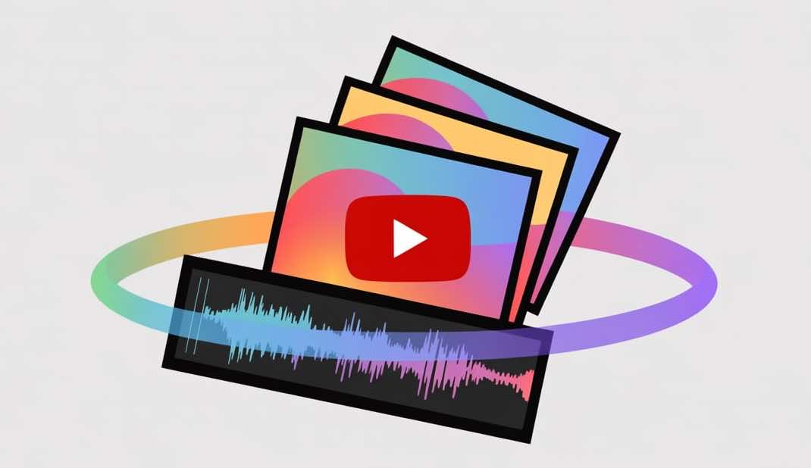

<!-- README.md -->
# Make Video Script

A simple bash script that transforms audio-only content into YouTube-ready videos by adding visual elements. Perfect for converting podcasts, interviews, music, or any audio content into uploadable video format using FFmpeg.



## Features

- 🎥 **YouTube-Ready Videos**: Transform any audio content into uploadable video format
- 🎙️ **Podcast & Interview Support**: Convert audio-only content to video for YouTube uploads
- 🖼️ **Static Image Videos**: Create videos from a single image with background audio
- 🎬 **Mixed Media Slideshows**: Create slideshow videos from images and videos with custom duration per slide
- 🎞️ **Video Joining**: Combine multiple videos and images into a single output video
- 🎵 **Audio Support**: Works with various audio formats (MP3, M4A, WAV, etc.)
- ⚙️ **Customizable Bitrate**: Control audio quality with custom bitrate settings
- 🚀 **Simple CLI**: Easy-to-use command-line interface
- 🔁 **Looping Support**: Seamlessly loop one or more videos to match audio length
- 🧩 **Chunked Processing**: Auto/forced chunking for long audio with safe concat

## Prerequisites

- **FFmpeg**: This script requires FFmpeg to be installed on your system
  - macOS: `brew install ffmpeg`
  - Ubuntu/Debian: `sudo apt update && sudo apt install ffmpeg`
  - Windows: Download from [ffmpeg.org](https://ffmpeg.org/download.html)

## Installation

1. Clone this repository:
   ```bash
   git clone https://github.com/yourusername/make_video.git
   cd make_video
   ```

2. Make the script executable:
   ```bash
   chmod +x make_video.sh
   ```

## Usage

### Static Image Video

Create a video from a single image with background audio:

```bash
./make_video.sh image.jpg audio.m4a output.mp4 [bitrate]
```

**Example:**
```bash
./make_video.sh photo.jpg background_music.mp3 my_video.mp4 192k
```

### Single Video with Audio

Create a video by adding audio to an existing video:

```bash
./make_video.sh video.mp4 audio.m4a output.mp4 [bitrate]
```

**Example:**
```bash
./make_video.sh interview_video.mp4 background_music.mp3 final_video.mp4 192k
```

### Mixed Media Slideshow

Create a slideshow video from multiple images and videos:

```bash
./make_video.sh 'img1.jpg,video1.mp4,img2.jpg' audio.m4a output.mp4 [bitrate] --slideshow 5
```

**Example:**
```bash
./make_video.sh 'slide1.jpg,intro_video.mp4,slide2.jpg,outro_video.mp4' presentation_audio.wav slideshow.mp4 256k --slideshow 3
```

### Parameters

- `media(s)`: Single media file or comma-separated list of images and videos for slideshow
- `audio`: Audio file to use as background music
- `output.mp4`: Name of the output video file
- `bitrate` (optional): Audio bitrate (default: 128k)
- `--slideshow duration`: Duration in seconds for each slide (slideshow mode only)
- `--loop`: Loop the media sequence to cover the full audio duration
- `--chunk`: Force chunked processing for long audio (recommended for 20+ minutes)
- `--chunk-seconds N`: Chunk duration in seconds (default: 300)

### Looping and Multi-Video Sequence

Loop one or more videos to span the entire audio:

```bash
./make_video.sh "my_videos/Jazzy Mantra Mix/Cat Dance.mp4,my_videos/Jazzy Mantra Mix/Cat Dance 2.mp4" \
  "my_videos/Jazzy Mantra Mix/Beira Mar Suno Recording 9-13-25, 23.01.21.m4a" \
  jazzy_cat_dance_output.mp4 192k --loop
```

The script calculates repeats and concatenates the sequence transparently.

### Chunked Processing (Long Audio)

For very long audio (e.g., 30–60+ minutes), one-pass rendering can be memory intensive. This script can:
- Auto-switch to chunked processing when the repeat segment count is high
- Or you can force chunking with `--chunk` and control chunk size via `--chunk-seconds` (default 300s)

```bash
# Force chunking with 5-minute chunks (safe and memory-efficient)
./make_video.sh "video1.mp4,video2.mp4" long_audio.m4a output.mp4 192k --loop --chunk --chunk-seconds 300

# Larger chunks (10 minutes) reduce concatenation steps
./make_video.sh "video1.mp4,video2.mp4" long_audio.m4a output.mp4 192k --loop --chunk --chunk-seconds 600
```

What happens in chunked mode:
1. Audio is segmented without re-encoding
2. Each chunk is rendered with the media loop (nested call with auto-chunk disabled)
3. All chunk videos are losslessly concatenated (`ffmpeg -f concat -c copy`)

## Examples

### Convert a podcast to YouTube video
```bash
./make_video.sh podcast_cover.jpg episode_audio.mp3 podcast_video.mp4 192k
```

### Create an interview video with mixed media
```bash
./make_video.sh 'interview_intro.mp4,guest_photo.jpg,interview_clip.mp4,company_logo.png' interview_audio.wav interview_video.mp4 256k --slideshow 10
```

### Convert music to YouTube video
```bash
./make_video.sh album_art.jpg song.mp3 music_video.mp4
```

### Join multiple videos with audio
```bash
./make_video.sh 'intro.mp4,main_content.mp4,outro.mp4' background_music.mp3 complete_video.mp4 192k --slideshow 0
```

### Create a presentation video
```bash
./make_video.sh 'slide1.png,slide2.png,slide3.png' voiceover.wav presentation.mp4 128k --slideshow 8
```

## Supported Formats

### Image Formats
- JPEG (.jpg, .jpeg)
- PNG (.png)
- BMP (.bmp)
- TIFF (.tiff)
- And other formats supported by FFmpeg

### Video Formats
- MP4 (.mp4)
- AVI (.avi)
- MOV (.mov)
- MKV (.mkv)
- WMV (.wmv)
- FLV (.flv)
- WebM (.webm)
- M4V (.m4v)
- 3GP (.3gp)
- OGV (.ogv)
- And other formats supported by FFmpeg

### Audio Formats
- MP3 (.mp3)
- M4A (.m4a)
- WAV (.wav)
- AAC (.aac)
- OGG (.ogg)
- And other formats supported by FFmpeg

### Output Format
- MP4 (.mp4) with H.264 video codec and AAC audio codec

## Technical Details

The script uses FFmpeg with the following configurations:
- **Video Codec**: H.264 (libx264)
- **Audio Codec**: AAC
- **Pixel Format**: YUV420P (for maximum compatibility)
- **Video Filter**: Automatic padding to ensure even dimensions
- **Duration**: Automatically matches the shortest input (audio or video)

## Troubleshooting

### Common Issues

1. **"ffmpeg: command not found"**
   - Install FFmpeg using the instructions in the Prerequisites section

2. **"Permission denied"**
   - Make sure the script is executable: `chmod +x make_video.sh`

3. **"No such file or directory"**
   - Check that all input files exist and paths are correct
   - Use absolute paths if needed

4. **Video quality issues**
   - Try increasing the bitrate (e.g., 256k, 320k)
   - Ensure input images are high quality

5. **Output won't play or process was killed (Killed: 9)**
   - The job likely exceeded system memory; use `--chunk` (and optionally increase `--chunk-seconds`)
   - Example:
     ```bash
     ./make_video.sh "video1.mp4,video2.mp4" long_audio.m4a output.mp4 192k --loop --chunk
     ```

### Getting Help

If you encounter issues:
1. Check that FFmpeg is properly installed: `ffmpeg -version`
2. Verify all input files exist and are accessible
3. Try with different file formats
4. Check the FFmpeg documentation for advanced options

## Contributing

Contributions are welcome! Please feel free to submit a Pull Request. For major changes, please open an issue first to discuss what you would like to change.

## License

This project is open source and available under the [MIT License](LICENSE).

## Use Cases

- **Podcasters**: Convert audio episodes to YouTube videos with cover art
- **Musicians**: Create music videos from album artwork and audio tracks
- **Interviewers**: Transform audio interviews into engaging video content
- **Content Creators**: Make any audio content YouTube-ready with visual elements
- **Educators**: Convert audio lectures or presentations to video format

## Acknowledgments

- Built with [FFmpeg](https://ffmpeg.org/) - the powerful multimedia framework
- Inspired by the need to make audio content YouTube-compatible

---

**Transform your audio into YouTube-ready videos!** 🎬✨
